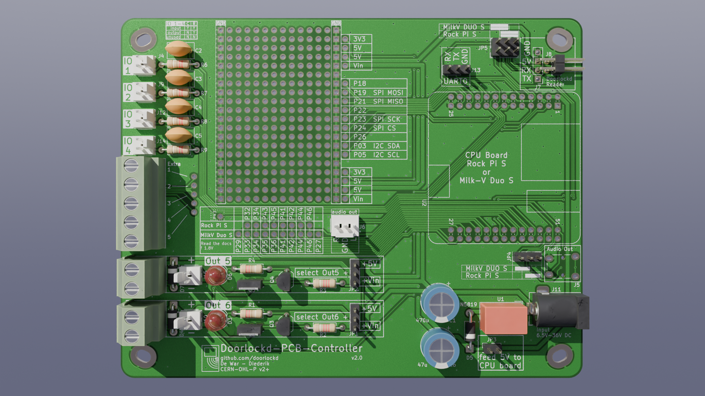

# Doorlockd controller
This repository contains a PCB for a doorlockd controller, which
(together with a remote card reader) reads RFID tags and controls a lock
solenoid or other devices.

The main controller can be a Rock Pi S or Milk-V Duo S Linux board, which is
stacked on top of this PCB. This PCB then provides power, a bunch of I/O
options (for buttons, leds, RFID reader, solenoids, etc.) plus a bit of
stripboard for custom additions.

This PCB is designed to be used with other [doorlockd hardware and
software](https://github.com/doorlockd/), but can also be used with any
other software running on the same Linux boards.

See the [doorlockd organization page](https://github.com/doorlockd/) for
some info about the system in practice.

## Features

This PCB provides:

 - Support for a Rock Pi S or Milk-V Duo board. To support both, in
   addition to software chagnes, some jumpers must be set correctly, and
   on there are some differences between both board for the pins on the
   stripboard area.
 - 6.5-36VDC power input (VIN), regulated to 5V to power the Linux board. 3V3
   then taken from the Linux board.
 - 4 Generic I/O circuits (numbered IO1-IO4), can be configured (by
   soldering) as direct input/output, output with series resistance or
   input with RC filter.  Available on 2.54mm pin headers directly, or
   up to 5 pins on screw terminals via wire bridges.
 - 2 low-side switched FET outputs (numbered OUT5 and OUT6) for solenoid
   or other high-current loads on screw terminals (high-side pin
   selectable between 5V and VIN).
 - UART connection to the RFID reader (e.g.
   [doorlockd-PCB-Reader](/doorlockd/doorlockd-PCB-Reader)), available
   on a square (2x2) or rectangular (1x4) connector with standard 2.54mm
   pitch. The square connector makes it easy to feed the cable through
   a round hole in e.g. a door frame.
 - 4-pin 2.54mm connector for UART connection to . Available as 1x4 pin, or
   2x2 pin (for easier feeding through a circular hole).
 - Audio (line out) on 3.5mm jack or pin header (direct from Linux
   board).
 - Stripboard area for custom extra peripherals.

## Pinout
Because the board supports two different linux board, the actual pinout
differs based on the board used.

The pins near the stripboard are intended for future experiments. The
pins to the right of the stripboard are either generic GPIO pins, or
dedicated function (SPI and I²C) pins that have the same function both
boards. All these pins support 3.3V (except for P26, which an 1.8V ADC
pin on the Rock Pi).

The pins below the stripboard are divided into a separate header for
each of the boards, since what is an IO pin on one board could be a GND
or some other special-function pin on the other. The Milk-V pins below
the stripboard only support up to 1.8V (see below).

The spreadsheet in this repository gives an overview of all pins
available on the board, where they are connected on both types of
board and what pin functions are available on those pins.

In the spreadsheet, the "doorlockd-PCB-Controller" is the main sheet to
use. This lists all the pins on the controller PCB, along with the pin
on U2 (Rock pi S or Milk-V Duo S) that it is connected to. To the right
there are two sections, one for each board, showing the name that the
board gives to that pin, and the available pin functions.

For the pin functions, three columns are available. The first column
shows a filter expression, such as `*GPIO*` and the second column shows
all pin functions (on that pin) that match the filter. The third column
is similar, except that the filter is taken from the column header (so
you can filter all pins at the same time to find a particular pin
function). You can use the `*` filter to list all available pin
functions.

The other sheets in the spreadsheet file provide are similar, but
start from the pins on the Milk-V and Rock Pi boards, instead of the
doorlockd controller PCB.

### 3.3V and 1.8V pins
On the Rock Pi S all pins (except ADC) operate at 3.3V, but the Milk-V
Duo S has both 3.3V and 1.8V pins, so care should be taken when using
those pins. These 1.8V pins are used on the high-current FET inputs
(where they are shielded from the outside worled) and available on the
stripboard (on J18), where care should be taken to not overload them.

If a Milk-V Duo is used and the 3.3V pins on J22 are not sufficient, the
1.8V pins on J18 can be used. If 3.3V operation is needed, the board is
designed so a standard level shifter board can be connected with the low
side plugging into J18 and the high side into stripboard pins.

For example, using [this 8-channel shifter from
Adafruit](https://www.adafruit.com/product/395), using J18-1 (P29) as
VCCA and J18-10 (P27) as OE (configuring P29 as output high and P27 as
output low). Pin P43 is available nearby to be used for VCCB. Similarly,
[this 4-channel shfiter](https://www.adafruit.com/product/1875) can also
be used.

### ADC pins
On both boards, once ADC pin is available.

Rock pi has P26, located to the right of the stripboard. This pin is not
usable as a GPIO.

Milk-V has P46, located below the stripboard. This pin can also be used
as a GPIO.

On both boards, the ADC pins support up to 1.8V only.

## Housing
PCB dimensions: 132×103mm

The PCB has oval mounting holes supporting two different housing series:

 - RND455 121×171mm, with mounting holes spaced 118×91mm.
   This series includes: RND 455-01088 (dark grey ABS, IP67), RND
   455-01072 (light grey polycarbonate with clear lid, IP67), RND
   455-00242 (light grey polycarbonate with clear lid, IP65), 

 - RP1235 165×125mm, with mounting holes spaced 120×90mm.
   This series includes: RP1235BF (light grey ABS), RP1235BFC (light
   grey ABS with clear lid), RP1230BF (light grey polycarbonate),
   RP1230BFC (light grey polycarbonate with clear lid). Also
   RP1235/RP1235C/RP1230/RP1230C are the same but without the bottom
   flange for wall mounting. All are IP65.

The RND series is a lot cheapter, but not as widely available as the
Hammond ones.

## Origins & grid
The origins in the PCB layout became a bit inconsistent. The aux/drill
origin is set to the top left corner of the PCB (so you can set the
KiCad Display origin to drill in the KiCad preferences to get
board-local coordinates).

The grid origin was originally intended to be in the center of the
board, but with some board resizing it got misplaced. To not mess up
existing grid-aligned objects, it was left in place.

The idea was to put all connectors on a 100mil grid (to allow adding
another bit of stripboard on top and connect it to the connectors if
needed), and then components on a 20mil grid, but this was not
consistently done (so different parts of the PCB are unaligned with each
other. Oh well.

## License
Copyright 2025 Diederik Hamelink (wie-niet)
Copyright 2025 Matthijs Kooijman (matthijs@stdin.nl)

This source describes Open Hardware and is licensed under the CERN-OHL-P
v2 or any later version.

You may redistribute and modify this documentation and make products
using it under the terms of the CERN-OHL-P v2 (https:/cern.ch/cern-ohl).

This documentation is distributed WITHOUT ANY EXPRESS OR IMPLIED
WARRANTY, INCLUDING OF MERCHANTABILITY, SATISFACTORY QUALITY AND FITNESS
FOR A PARTICULAR PURPOSE. Please see the CERN-OHL-P v2 for applicable
conditions

See LICENSE.txt for the full license text.
